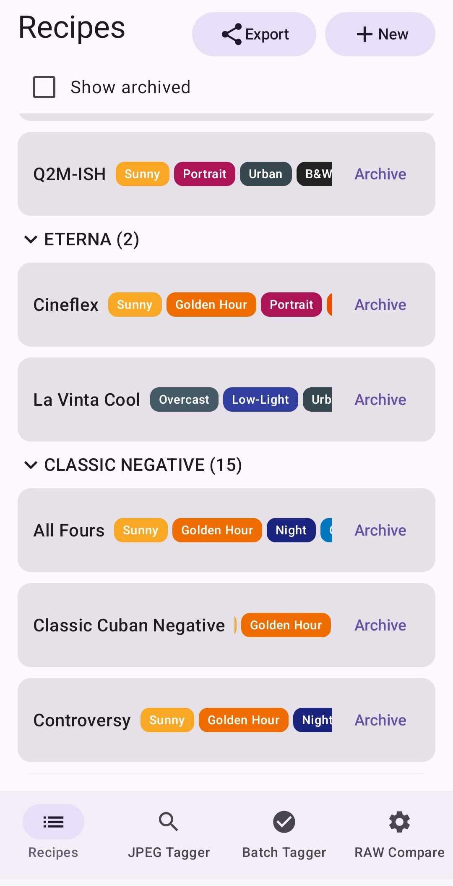
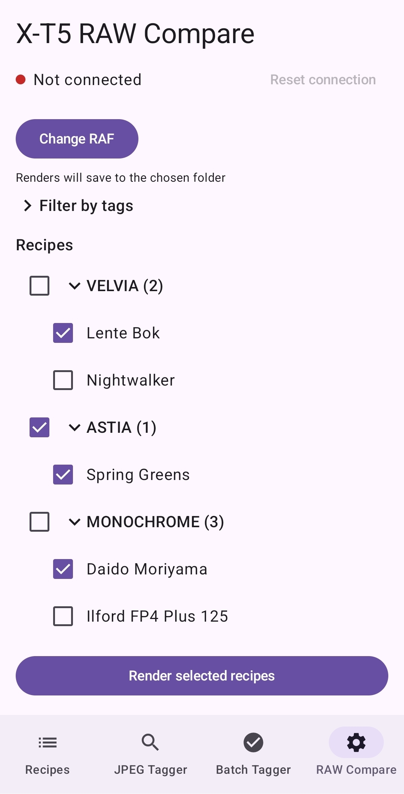
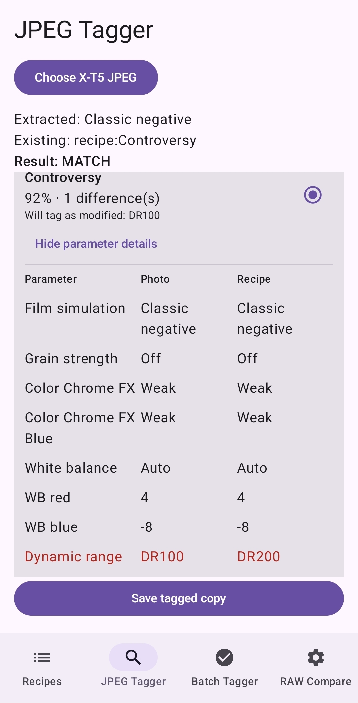

# Fuji Cook

Fuji Cook is an offline Android app for managing Fujifilm X-T5 film-simulation recipes, identifying recipes from original JPEG MakerNotes, tagging JPEGs, and rendering one RAF with multiple recipes through the camera's USB RAW converter.

  
  
  

## Build

Open the repository in Android Studio or run `./gradlew testDebugUnitTest assembleDebug`. No network permission or backend is used.

See [product specification](docs/PRODUCT_SPEC.md), [architecture](docs/ARCHITECTURE.md), [JSON format](docs/JSON_FORMAT.md), and [implementation plan](docs/IMPLEMENTATION_PLAN.md).
